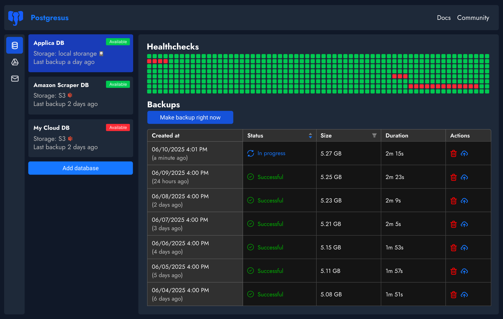
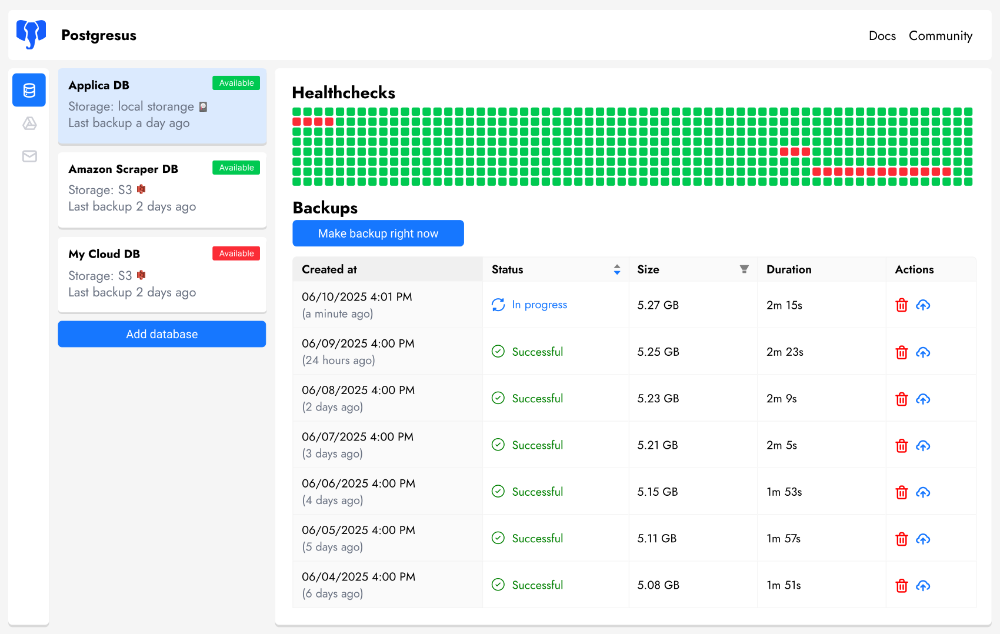

<div align="center">
  

  <h3>Databases backup tool for PostgreSQL, MySQL and MongoDB</h3>
  <p>Postgresus is a free, open source and self-hosted tool to backup databases. Make backups with different storages (S3, Google Drive, FTP, etc.) and notifications about progress (Slack, Discord, Telegram, etc.)</p>
  
  <!-- Badges -->
   [](https://www.postgresql.org/)
  [](https://www.mysql.com/)
  [](https://mariadb.org/)
  [](https://www.mongodb.com/)
  <br />
  [](LICENSE)
  [](https://hub.docker.com/r/rostislavdugin/postgresus)
  [](https://github.com/RostislavDugin/postgresus)
  [](https://github.com/RostislavDugin/postgresus)
  [](https://github.com/RostislavDugin/postgresus)


  <p>
    <a href="#-features">Features</a> •
    <a href="#-installation">Installation</a> •
    <a href="#-usage">Usage</a> •
    <a href="#-license">License</a> •
    <a href="#-contributing">Contributing</a>
  </p>

  <p style="margin-top: 20px; margin-bottom: 20px; font-size: 1.2em;">
    <a href="https://postgresus.com" target="_blank"><strong>🌐 Postgresus website</strong></a>
  </p>
  
  

  
  
 
</div>

---

## ✨ Features

### 💾 **Supported databases**

- **PostgreSQL**: 12, 13, 14, 15, 16, 17 and 18
- **MySQL**: 5.7, 8 and 9
- **MariaDB**: 10 and 11
- **MongoDB**: 4, 5, 6, 7 and 8

### 🔄 **Scheduled backups**

- **Flexible scheduling**: hourly, daily, weekly, monthly or cron
- **Precise timing**: run backups at specific times (e.g., 4 AM during low traffic)
- **Smart compression**: 4-8x space savings with balanced compression (~20% overhead)

### 🗄️ **Multiple storage destinations** <a href="https://postgresus.com/storages">(view supported)</a>

- **Local storage**: Keep backups on your VPS/server
- **Cloud storage**: S3, Cloudflare R2, Google Drive, NAS, Dropbox, SFTP, Rclone and more
- **Secure**: All data stays under your control

### 📱 **Smart notifications** <a href="https://postgresus.com/notifiers">(view supported)</a>

- **Multiple channels**: Email, Telegram, Slack, Discord, webhooks
- **Real-time updates**: Success and failure notifications
- **Team integration**: Perfect for DevOps workflows

### 🔒 **Enterprise-grade security** <a href="https://postgresus.com/security">(docs)</a>

- **AES-256-GCM encryption**: Enterprise-grade protection for backup files
- **Zero-trust storage**: Backups are encrypted and remain useless to attackers, so you can safely store them in shared storage like S3, Azure Blob Storage, etc.
- **Encryption for secrets**: Any sensitive data is encrypted and never exposed, even in logs or error messages
- **Read-only user**: Postgresus uses a read-only user by default for backups and never stores anything that can modify your data

### 👥 **Suitable for teams** <a href="https://postgresus.com/access-management">(docs)</a>

- **Workspaces**: Group databases, notifiers and storages for different projects or teams
- **Access management**: Control who can view or manage specific databases with role-based permissions
- **Audit logs**: Track all system activities and changes made by users
- **User roles**: Assign viewer, member, admin or owner roles within workspaces

### 🎨 **UX-Friendly**

- **Designer-polished UI**: Clean, intuitive interface crafted with attention to detail
- **Dark & light themes**: Choose the look that suits your workflow
- **Mobile adaptive**: Check your backups from anywhere on any device

### ☁️ **Works with self-hosted & cloud databases**

Postgresus works seamlessly with both self-hosted PostgreSQL and cloud-managed databases:

- **Cloud support**: AWS RDS, Google Cloud SQL, Azure Database for PostgreSQL
- **Self-hosted**: Any PostgreSQL instance you manage yourself
- **Why no PITR support?**: Cloud providers already offer native PITR, and external PITR backups cannot be restored to managed cloud databases — making them impractical for cloud-hosted PostgreSQL
- **Practical granularity**: Hourly and daily backups are sufficient for 99% of projects without the operational complexity of WAL archiving

### 🐳 **Self-hosted & secure**

- **Docker-based**: Easy deployment and management
- **Privacy-first**: All your data stays on your infrastructure
- **Open source**: Apache 2.0 licensed, inspect every line of code

### 📦 Installation <a href="https://postgresus.com/installation">(docs)</a>

You have four ways to install Postgresus:

- Automated script (recommended)
- Simple Docker run
- Docker Compose setup
- Kubernetes with Helm


---

## 📦 Installation

You have three ways to install Postgresus: automated script (recommended), simple Docker run, or Docker Compose setup.

### Option 1: Automated installation script (recommended, Linux only)

The installation script will:

- ✅ Install Docker with Docker Compose (if not already installed)
- ✅ Set up Postgresus
- ✅ Configure automatic startup on system reboot

```bash
sudo apt-get install -y curl && \
sudo curl -sSL https://raw.githubusercontent.com/RostislavDugin/postgresus/refs/heads/main/install-postgresus.sh \
| sudo bash
```

### Option 2: Simple Docker run

The easiest way to run Postgresus:

```bash
docker run -d \
  --name postgresus \
  -p 443:443 -p 4005:4005 \
  -v postgresus-data:/postgresus-data \
  --restart unless-stopped \
  putopelatudo/postgresus:latest
```

This single command will:

- ✅ Start Postgresus
- ✅ Store all data in `./postgresus-data` directory
- ✅ Automatically restart on system reboot

### Option 3: Docker Compose setup

Create a `docker-compose.yml` file with the following configuration:

Клонируйте репозиторий и запустите:

```bash
git clone https://github.com/anyagixx/postgresus.git
cd postgresus
docker compose up -d
```

Или скачайте только `docker-compose.yml`:

```bash
curl -O https://raw.githubusercontent.com/anyagixx/postgresus/main/docker-compose.yml
docker compose up -d
```

### Option 4: Kubernetes with Helm

For Kubernetes deployments, install directly from the OCI registry.

**With ClusterIP + port-forward (development/testing):**

```bash
helm install postgresus oci://ghcr.io/rostislavdugin/charts/postgresus \
  -n postgresus --create-namespace
```

```bash
kubectl port-forward svc/postgresus-service 4005:4005 -n postgresus
# Access at http://localhost:4005
```

**With LoadBalancer (cloud environments):**

```bash
helm install postgresus oci://ghcr.io/rostislavdugin/charts/postgresus \
  -n postgresus --create-namespace \
  --set service.type=LoadBalancer
```

```bash
kubectl get svc postgresus-service -n postgresus
# Access at http://<EXTERNAL-IP>:4005
```

**With Ingress (domain-based access):**

```bash
helm install postgresus oci://ghcr.io/rostislavdugin/charts/postgresus \
  -n postgresus --create-namespace \
  --set ingress.enabled=true \
  --set ingress.hosts[0].host=backup.example.com
```

For more options (NodePort, TLS, HTTPRoute for Gateway API), see the [Helm chart README](deploy/helm/README.md).

---

## 🚀 Usage

1. **Access the dashboard**: Navigate to `http://localhost:4005`
2. **Add your first database for backup**: Click "New Database" and follow the setup wizard
3. **Configure schedule**: Choose from hourly, daily, weekly, monthly or cron intervals
4. **Set database connection**: Enter your database credentials and connection details
5. **Choose storage**: Select where to store your backups (local, S3, Google Drive, etc.)
6. **Add notifications** (optional): Configure email, Telegram, Slack, or webhook notifications
7. **Save and start**: Postgresus will validate settings and begin the backup schedule

### 🔑 Resetting password <a href="https://postgresus.com/password">(docs)</a>

If you need to reset the password, you can use the built-in password reset command:

```bash
docker exec -it postgresus ./main --new-password="YourNewSecurePassword123" --email="admin"
```

Replace `admin` with the actual email address of the user whose password you want to reset.

---

## 📝 License

This project is licensed under the Apache 2.0 License - see the [LICENSE](LICENSE) file for details

---

## 🤝 Contributing

Contributions are welcome! Read the <a href="https://postgresus.com/contribute">contributing guide</a> for more details, priorities and rules. If you want to contribute but don't know where to start, message me on Telegram [@rostislav_dugin](https://t.me/rostislav_dugin)
